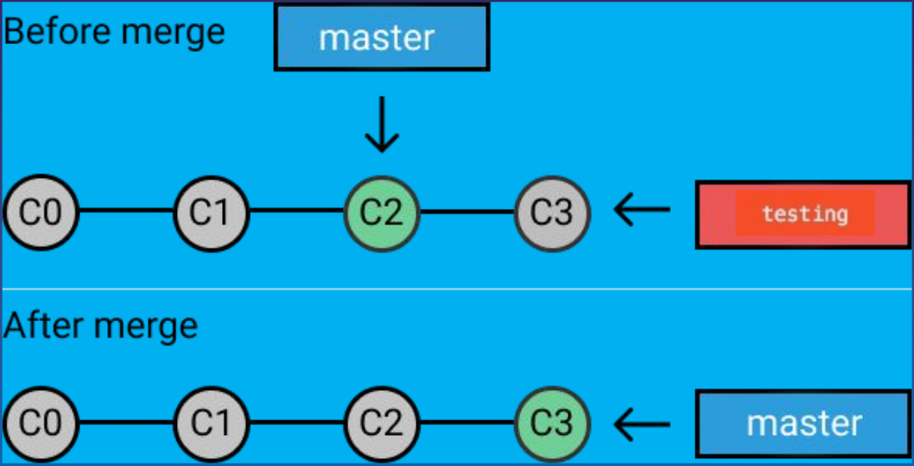

Branching means you diverge from the main line of development and continue to do work without messing with that main line.

- Branches in git are incredibly lightweight.
- “Killer Feature” of git.

We can compare it like the way we deal with a note book. Suppose, we have a note book containing the solution of some math problems. We should always like to keep our note book clean. So, before we write a new solution in our note book, we write the solution somewhere else and and verify it. After verifying the solution is correct we put it into the note book. In summery what we did is -

Note Book (master branch) -> Open new branch named `new solution` - `git checkout -b new-solution` -> we worked on new-solution branch until we verified that our solution is correct -> Once solution is verified, we put the new solution into the note book (master branch) by - `git merge new-solution`

## Create A Branch

Creating a new branch just create new pointer to the same commit you are currently on.

```shell
$ git branch new-branch-name
```

## Switching To A Branch

To switch to an existing branch, we run the following command:

```shell
$ git checkout new-branch-name
```

### 3 Way Merge


### Fast Forward Merge



## Merge A Branch

```shell
$ git merge branch-name
```

## Delete A Local Branch

We may want to delete a branch once that has been merged

```shell
$ git branch -d my-branch-name
```
