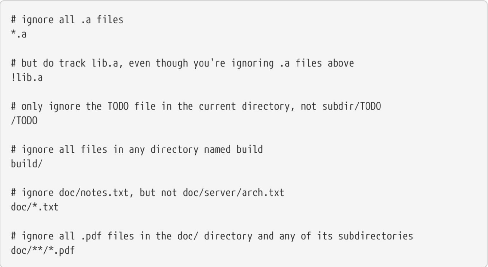

Ignored files are tracked in a special file named .gitignore that is checked in at the root of your repository.

## Open a .gitignore file

```shell
$ touch .gitignore
```

## Edit .gitignore file

```shell
$ vi .gitignore
```


