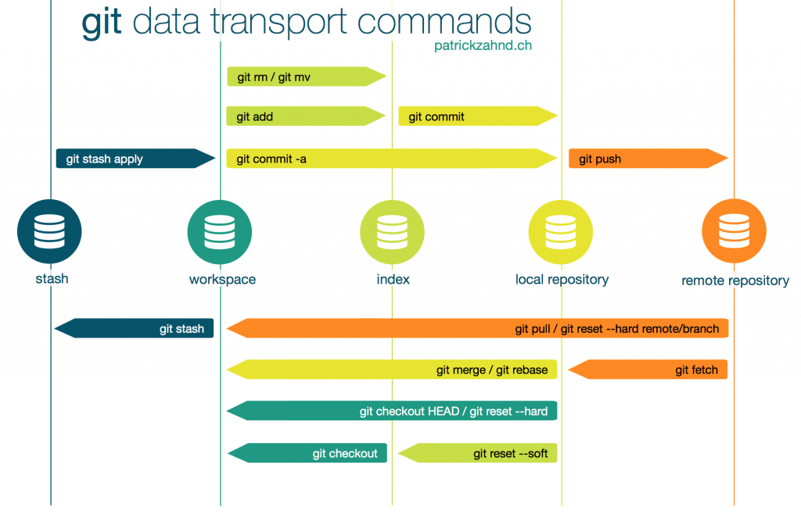

`git pull` and `git rebase` are not interchangeable, but they are closely connected.

`git pull` does `git fetch` **+** `git merge`

`git rebase` is used after using `git fetch`. But that can also be done using `git pull --rebase` which does `git fetch` **+** `git rebase` behind the scene.

I personally prefer doing work in small chunks. So, to import update from remote repository I use `git fetch` first and then `git rebase`. Also, rebasing is preferable mostly for clean commit history.



## Git Fetch

Since the remote repository contains more commits than our local repository, we need to fetch those commits from the remote repository to the local repository. We can achieve that by doing -

```shell
$ git fetch
```

## Git Rebase

Once we have fetched the commits from remote location in our local repository, we can rebase that to get the commits in our workspace.

```shell
$ git rebase origin/master
```

`origin` is the remote location and `master` is the branch
