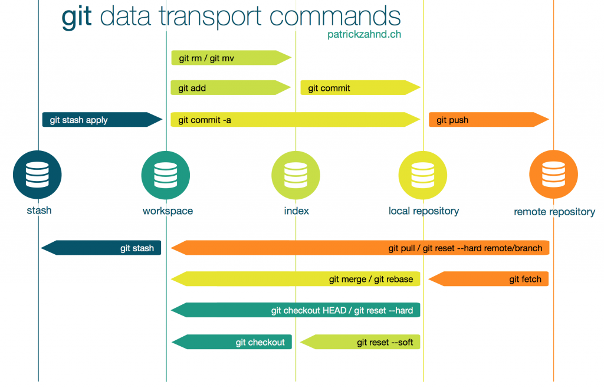

- `Workspace` is the place where we are currently working.
- `index` is the place we save our edits temporarily to add them in a future commit.
- `local repository` is the place where all commit are kept.

Previously, we had added a file named `helloWorld.cpp` from our workspace and edited that file in the `workspace`. After we had run the command `git add helloWorld.cpp`, the change had saved to `index` or `staging` area. After we had committed the changes from `index` with command `git commit -m "hello world c++ program added"`, it saves the commit in `local repository`.
